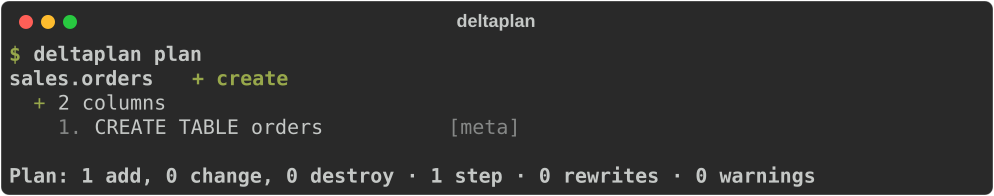
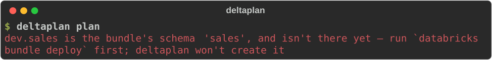

# With an Asset Bundle

Most Databricks projects already have a
[bundle](https://docs.databricks.com/aws/en/dev-tools/bundles/): `databricks.yml`, with
the targets, the workspaces, the variables, and often the schema the tables live in.
deltaplan reads it, so none of that is written twice.

The division is simple: **the bundle owns the containers, deltaplan owns the tables in
them.**

<hr class="dp-rule">

## Point at it

```yaml title="deltaplan.yml"
--8<-- "assets/screens/bundle-project.yml"
```

That's the whole connection. From the bundle deltaplan takes:

| From the bundle | What deltaplan does with it |
|---|---|
| `targets` and the `default: true` one | its own targets; `-t` picks one, and without `-t` the bundle's default |
| `workspace.profile` / `workspace.host` | how to reach the workspace |
| `variables` | `${catalog}` and friends in your specs |
| a `warehouse_id` variable | the SQL warehouse, including a `lookup:` by name |
| `resources.catalogs`, `.schemas`, `.volumes` | names your specs can use — and objects deltaplan leaves alone |

Files listed under `include:` are read too, which is where most bundles keep their
resources.

## Name things once

A bundle that declares the schema:

```yaml title="databricks.yml"
--8<-- "assets/screens/bundle-databricks.yml"
```

A spec can point straight at it, in the bundle's own spelling:

```yaml title="tables/orders.yml"
--8<-- "assets/screens/bundle-orders.yml"
```



Variables work either way — `${catalog}` or the bundle's `${var.catalog}` — so an
existing spec needs no rewriting.

## What deltaplan won't touch

A catalog, schema or volume the bundle declares is the bundle's:

- **It is never created or managed by deltaplan.** Two tools creating the same schema is
  how a later `databricks bundle deploy` meets an object it didn't make.
- **A deltaplan spec for one is an error**, naming the bundle's resource, so you find out
  at `validate` rather than halfway through an apply.
- **`import` writes no spec for it.**
- **A table whose schema isn't deployed yet** stops the plan and says what to run:



So the order of a first run is: `databricks bundle deploy`, then `deltaplan apply`.

## Development mode, and other renaming

A target in `mode: development`, or one with `presets.name_prefix`, does not deploy the
names that are in the file — the Databricks CLI rewrites them first:

| target | the schema `sales` deploys as |
|---|---|
| `mode: development` | `dev_jane_sales` |
| `presets: {name_prefix: team_}` | `teamsales` — the underscore dropped |
| neither | `sales` |

Schemas are renamed this way; catalogs and volumes aren't. deltaplan doesn't
reimplement any of it. For a target that renames anything it asks the CLI for the
configuration as deployed —

```sh
databricks bundle validate -o json -t dev
```

— and uses the names that come back. That means the
[Databricks CLI](https://docs.databricks.com/aws/en/dev-tools/cli/) has to be on your
`PATH` for such a target, and be logged in: a development target has to know whose name
goes in front. Without it the names stay *unknown*, and a spec that uses one says why,
rather than planning against the wrong schema. A target that renames nothing is read
straight from the file, with no CLI needed.

## deltaplan.yml has the last word

A bundle has no word for some things, so `deltaplan.yml` adds them:

```yaml title="deltaplan.yml"
specs: [tables]
bundle: databricks.yml

targets:
  prod:
    mode: strict            # deltaplan's own: additive or strict
    warehouse_id: abc123def456
    vars:
      catalog: prod         # overrides the bundle's variable
```

A target named here that the bundle doesn't have is an error — it's almost certainly a
typo. And a bundle's own `mode: development | production` is about jobs and pipelines: it
has nothing to do with deltaplan's [`additive` or `strict`](safety.md#additive-and-strict-schemas),
and is ignored.

## What needs a workspace

Some values a bundle can't settle on its own: a `lookup:` other than the warehouse, a
complex variable, anything using `${workspace.current_user.short_name}`. deltaplan
doesn't guess them. A spec that uses one fails and says which value is missing and why;
give it under that target's `vars` instead.

## In CI

The [GitHub Action](ci.md) takes the same target name:

```yaml
- uses: misja-pronk/deltaplan@v0
  with:
    target: prod          # the bundle's target
```

Deploy the bundle first and apply after, so the schemas exist before the tables that go
in them:

```yaml
- run: databricks bundle deploy -t prod
- uses: misja-pronk/deltaplan@v0
  with:
    command: apply
    target: prod
```
