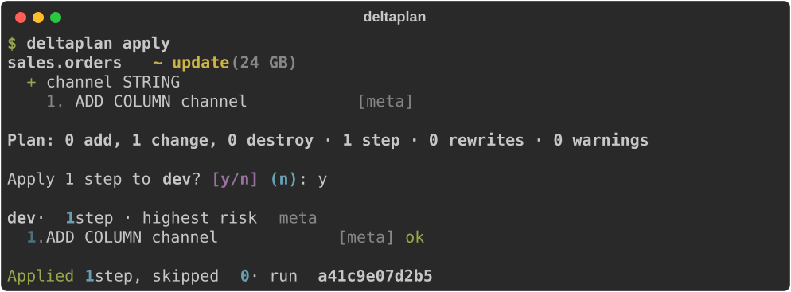

# Commands

```
deltaplan validate            # spec lint, no connection needed
deltaplan import <schema>     # live tables -> YAML specs
deltaplan plan -t <target> [-o plan.json] [--select <name>] [--format rich|md|json]
deltaplan apply [-t <target>] [--select <name>] [--yes]   # plan, show, ask, run
deltaplan apply plan.json     # run a saved plan, as CI does
deltaplan show plan.json [--format rich|md|json]
deltaplan drift -t <target>   # exit code 2 on drift, for CI
deltaplan force-unlock
```

Every command takes `--config` to point at a `deltaplan.yml`, and `-t/--target` to pick
the target whose variables are substituted — without it, the only target or the one
marked `default: true` (in `deltaplan.yml` or the [bundle](spec.md#next-to-an-asset-bundle)).
`plan` and `import` also take `--warehouse-id`, which otherwise comes from the target
or `$DATABRICKS_WAREHOUSE_ID`.

## `validate`

```sh
deltaplan validate -t dev            # every spec in the project
deltaplan validate tables/orders.yml # just these
```

Lints specs offline: unknown keys, type strings, duplicate columns and nested fields,
`cluster_by` and primary-key columns that don't exist, nullable primary-key columns,
contradictory `renamed_from` hints, and type names that look misspelled. No credentials,
no network — ideal for a pre-commit hook or the fast lane of CI. Exits non-zero if
anything is wrong.

## `schema`

```sh
deltaplan schema spec       # the JSON Schema for YAML specs
deltaplan schema project    # ... and for deltaplan.yml
```

Prints the JSON Schema an editor uses for completion and inline errors, for the version
you have installed. See [editor support](editors.md).

## `import`

```sh
deltaplan import main.sales -o tables -t dev             # YAML specs
deltaplan import main.sales -o tables -t dev -f sql      # SQL specs
```

Generates specs from the tables, views and SQL functions that already exist, so adoption
doesn't start with a blank file. If the target has a variable whose value is that
catalog, the generated spec uses `${catalog}` instead of the literal name — foreign keys
into the same catalog too — so it fits every target. Non-Delta tables are reported and
skipped, and so are the platform's defaults and Unity Catalog's own bookkeeping
properties. An imported table is claimed as managed on its first apply.

`-f sql` writes `CREATE` statements. A table with column tags, masks or a row filter —
[what SQL specs can't say](formats.md#what-each-format-supports) — is written as YAML
instead, and the output says so.

## `adopt`

```sh
deltaplan drift                      # main.sales.orders has a column no spec mentions
deltaplan adopt main.sales.orders    # write it into the spec
git diff                             # and now it is a reviewable change
```

```
tables/orders.yml
  + columns: region string
Adopted 1 spec. `deltaplan plan` is quiet now: read the diff, and commit it.
```

The other direction from `apply`. `drift` can only tell you a table was changed by
hand; the change is usually *wanted*, and the only ways out were to retype it into the
spec or to apply the plan and undo someone's work. This is the third: the spec file is
edited to match the workspace, and what you are left with is a git diff.

**No table is touched** — this writes spec files and nothing else.

What it takes from the workspace is what deltaplan would otherwise have planned: a
column, a type, a nested field, `not null`, a comment, clustering, a view's query, a
function's body. What it leaves alone is everything a spec never claimed — a tag,
property or grant the file doesn't mention stays unmanaged, because adopting drift is
not the moment to start managing something new. A tag the spec *does* declare takes the
live value.

And what only a file can say survives, because the file is edited rather than
rewritten: `${catalog}` and every other variable, `renamed_from`, `using:`, a seed's
rows, hooks — and the comments and blank lines around them.

- Names work like `--select`: `orders`, `sales.orders`, `sales.*`. With none, every
  spec that has drifted.
- `--dry-run` prints what would change and writes nothing; `--diff` prints the new text.
- A `.sql` spec is refused with the reason: rewriting a `CREATE` statement from live
  state is not something to do by text search.
- After writing, deltaplan reads the file back and diffs it against the workspace. What
  it couldn't express is printed as *Still planned* — a seed is the usual one, because
  its rows live in the repo and no workspace can tell a file what they should be.

## `doctor`

```sh
deltaplan doctor
```

```
✓ project    deltaplan.yml, 14 specs in tables
✓ target     prod (catalog prod)
✓ bundle     databricks.yml — resolved via /opt/homebrew/bin/databricks
✓ workspace  https://dbc-1234abcd.cloud.databricks.com as you@example.com
⚠ warehouse  Serverless Starter (STOPPED)
             → It starts on the first statement. If it stays stopped, the workspace
               can't give it compute — that is not something deltaplan can fix.
✗ metastore  table quota 523 of 500
             → A dropped table counts for as long as UNDROP could bring it back, so
               this is often far above what the catalogs hold. …
```

Checks the project, the target, the bundle, the workspace, the warehouse, the metastore's
table quota, and where `apply` would record a run. Every line says what was looked at and
what was found; anything that isn't right says what to do about it.

It **changes nothing** — no schema is created, no warehouse started, no grant touched —
and exits 0 unless something will stop a run. `--json` gives a host the same findings.

Run it when a command fails in a way that seems to be about the environment rather than
about your specs. Most of these checks exist because something once surfaced five steps
into an apply instead of here.

## `verify`

```sh
deltaplan verify --schema main.scratch      # makes it, uses it, drops it
deltaplan verify --schema main              # deltaplan names the schema
```

```
Databricks behaviour deltaplan relies on, in https://dbc-1234.cloud.databricks.com
(main.scratch):
  ✓ a table can read itself in a REPLACE … AS SELECT
  ✓ a replace keeps a table's tags, column tags and grants
  ✓ RESTORE puts back the table a replace changed
  ✓ a nested field's NOT NULL is an ordinary ALTER
  ✓ the widenings deltaplan calls metadata are allowed
  ✓ a seed's INSERT OVERWRITE with a column list is accepted
  ✗ CLUSTER BY AUTO is accepted and reads back
      the table doesn't read back as CLUSTER BY AUTO
      → `cluster_auto: true` needs predictive optimization on the workspace.
      Without it, that spec can't be applied here — use explicit keys.
  18 held, 1 didn't.
```

Every plan deltaplan makes rests on Databricks behaviour: that a `REPLACE` keeps a
table's tags and grants, that a nested `NOT NULL` is an ordinary `ALTER`, that the
warehouse runs in ANSI mode. Those were settled against one workspace on one runtime.
This runs them against **yours**, and where one doesn't hold it says what that costs —
in the workspace's own words, so you can search for them.

It is the only command besides `apply` and `force-unlock` that writes: it creates a
schema, makes tables, views and functions in it, and drops the schema with everything
inside when it is done. It will not use a schema that already exists — it drops what it
made, and that has to be nothing of yours. Nothing outside that schema is read or
touched.

- `--slow` also runs the probes that take minutes (they start a Databricks pipeline).
- `--no-undrop` leaves out the one probe that needs a second schema which keeps what it
  drops — a dropped table holds the metastore's table quota for its recovery period.
- `--keep` leaves the schema behind to look at.
- `--principal` names a principal to grant to while probing (`account users` by default).
- `--json` gives a host every probe with its outcome, the docs link, and what rests on it.

Exits 0 when every probe held, 1 when one didn't. A `!` is a probe that couldn't be
carried out at all — a privilege you haven't got, a warehouse that stopped — which is
not an answer about behaviour.

Run it when adopting deltaplan in a new workspace, and after a runtime upgrade. The same
list is what deltaplan's own live suite runs, so a probe here is never a second opinion
about what the tool assumes: it is the assumption itself.

## `plan`

Reads live state, diffs it against the specs, and prints the plan. `--format`:

- `rich` — the terminal view: a tree of nested changes with numbered, risk-labelled steps.
- `md` — Markdown, for a pull-request comment. The [GitHub Action](ci.md) posts it for
  you.
- `json` — the plan object itself.
- `html` — one self-contained page, for reading a big plan: search, fold, and each
  step's SQL in place. See [`ui`](#ui).

`-o plan.json` saves the plan for `apply` and `show`. With the default `rich` format the
plan is printed as well and the file holds the plan object; with `-f md` or `-f json` the
file holds that format instead of the terminal getting it.

All of them render the same plan object, so the review and the artefact can't disagree.

Reading live state costs a query or two per table. Only tables a spec describes are read
in full; the rest of each schema gets a light read — enough to list it and tell whether
it's deltaplan's. `--parallel` (default 8) sets how many of those queries run at once;
`drift` and `import` take it too.
`--check-order` additionally diffs column order, which is off by default because a
reordered spec is usually an edit to the file rather than an intent to move columns.

`--clone` adds a `SHALLOW CLONE` of each table before the first step that could lose
its data — see the [safety model](safety.md#when-something-goes-wrong).

Tables in the schema that no spec describes are listed at the bottom as unmanaged, and
never touched.

## `show`

```sh
deltaplan show plan.json -f md
```

Renders a saved plan in any format, without a warehouse. What you see is what
`apply plan.json` would run — which is why the GitHub Action renders its comment this
way rather than planning twice.

## `ui`

```sh
deltaplan ui                  # plan now, and open it
deltaplan ui plan.json        # show a plan you already have
```

Serves the plan as one page on `127.0.0.1` and opens your browser. Each object is shown
as a comparison — **now** on the left, as it was read when the plan was made, and
**after** on the right — with the statements that get from one to the other underneath.

Two readings of the same table, because a plan has two readers:

- **Changes only** (the default) — the rows that move, each with the sentence deltaplan
  uses for it elsewhere. For whoever has to approve the change.
- **Full object** — every row, including what stays as it is, so the two sides can be
  checked against each other. For whoever wrote the spec.

The button remembers which you picked. There is one table underneath both, so they can't
say different things. Search filters by name, and the risk buttons narrow it to what is
`destructive` or `rewrite`.

`--port` picks the port (0, the default, takes a free one), `--no-open` leaves your
browser alone, and `-t`, `--select`, `--warehouse-id` and `--profile` work as they do for
`plan`.

It is a way of **reading** a plan: nothing is fetched from the network, nothing is
written, and there is no apply button. To change something, change a spec.

Want the page without a server — to attach to a pull request, keep as a CI artefact, or
send to someone who approves things:

```sh
deltaplan plan -f html -o plan.html
```

One file, no dependencies, opens offline.

## `apply`

```sh
deltaplan apply [-t dev] [--select sales.orders] [--yes] [--allow-destructive]
deltaplan apply plan.json [--allow-destructive]
```

Without a plan file, `apply` plans now, shows the plan and asks before it changes
anything — the quickest way from a spec to a table:



`--yes` skips the question; without it, a closed stdin (a CI job) counts as *no*. A plan
that destroys something is refused before the question, unless you pass
`--allow-destructive`.

With a plan file, `apply` runs exactly that plan — what CI does after a plan was
reviewed on a pull request. Either way it prints each step as it resolves:

```
dev · 6 steps · highest risk destructive

  1. enable typeWidening          [feature]  ok
  2. ALTER COLUMN TYPE            [meta]     ok
  3. ADD COLUMN address.zip       [meta]     skipped (already applied)
  4. enable columnMapping         [feature]  ok
  5. RENAME COLUMN                [meta]     ok
  6. DROP COLUMN                  [destructive] ok

Applied 5 steps, skipped 1 · run 3f9a2b1c4d5e
```

Four promises, and no others — DDL is not transactional across statements, so there is
no rollback:

- **Nothing runs from a stale plan.** Before a fresh run, `apply` re-reads every table
  the plan was built from and recomputes the state fingerprint. If anything moved, it
  refuses and tells you to plan again. (Which is also why applying the same file twice
  is refused: the second time, it *is* stale.)
- **Steps don't repeat themselves.** Before each step, deltaplan asks whether the change
  it implements is already true of the live table, and skips it if so.
- **A failed run resumes.** Every step's outcome is written to the history table, so
  running `deltaplan apply plan.json` again picks up from the step that failed instead
  of starting over. The fingerprint is not re-checked on a resume — of course the tables
  changed, the first half of the plan changed them.
- **One run at a time.** A lock row per target, taken with a conditional update and
  confirmed by reading it back. It has a one-hour TTL so a run that died can't hold it
  forever, and a live run renews it before every step — so a rewrite that takes longer
  than an hour keeps it. If a run ever finds it has lost the lock, it stops before the
  next step rather than carry on beside whoever took it.

`--select` (on `plan` and `apply`) narrows the work to some specs: a name as short as
`orders` or as full as `dev.sales.orders`, or a pattern like `sales.*`; repeat it for
more. A selection plans only what it names — tables outside it are never reported as
orphans, and never dropped, even in a strict schema.

`--allow-destructive` is required for any step in the `destructive` class; without it
`apply` refuses before running anything at all. A plan containing a step deltaplan
couldn't generate — a conversion it won't invent, a change a generated column
blocks — is refused the same way, naming the step and what it needs. A restore point —
the table's Delta version before the step — is recorded for every destructive step, so `RESTORE TABLE …
TO VERSION AS OF n` is one command.

### History

`apply` keeps three Delta tables in the schema named by `history_schema` in
`deltaplan.yml`, and creates the schema and the tables on first use:

| Table | One row per |
|---|---|
| `runs` | apply — with its plan hash, target, user, tool version and status |
| `steps` | step — with the SQL, the outcome, any error, and the Delta version before it |
| `lock` | target — held while a run is in flight |

## `drift`

```sh
deltaplan drift -t prod [-f rich|md|json] [-o file]
```

Asks whether `apply` would do anything, and exits accordingly:

| Exit code | Meaning |
|---|---|
| `0` | Live tables match their specs. |
| `2` | They have drifted — the plan is printed. |
| `1` | Something went wrong. |

Drift is a hand edit in the catalog, a table dropped outside deltaplan, a spec merged but
never applied. Unmanaged objects are not drift: deltaplan never claimed them. Point a
[scheduled workflow](ci.md#catch-drift-nightly) at it.

When the hand edit was the right call, [`adopt`](#adopt) writes it into the spec instead
of planning it away.

## `force-unlock`

```sh
deltaplan force-unlock -t prod
```

`apply` takes a lock so two runs can't fight over the same tables. If a run dies hard
without releasing it, this does — and tells you which run was holding it. The lock also
expires by itself after an hour.
