# Feature gallery

One change at a time: the spec as you'd write it, and the plan deltaplan makes from it
against a table that already exists. As in the [tour](tour.md), every terminal is real
output. For the full rules, follow the link at the end of each section to
[Writing a spec](spec.md).

<hr class="dp-rule">

## Columns

Add a column, add a field inside a struct, give a column a comment. All of these are
metadata: nothing is rewritten.

```yaml title="tables/orders.yml"
--8<-- "assets/screens/feature-columns.yml"
```

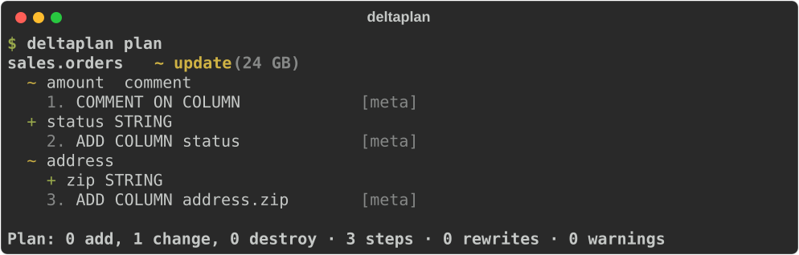

A field inside a struct, an array or a map is addressed by its path (`address.zip`,
`lines.element.qty`) and diffed like a column. [Types →](spec.md#types)

## Renames

Columns and tables are matched by name, so a rename would otherwise look like a drop and
an add: data loss. `renamed_from` says what happened.

```yaml title="tables/orders.yml"
--8<-- "assets/screens/feature-renames.yml"
```

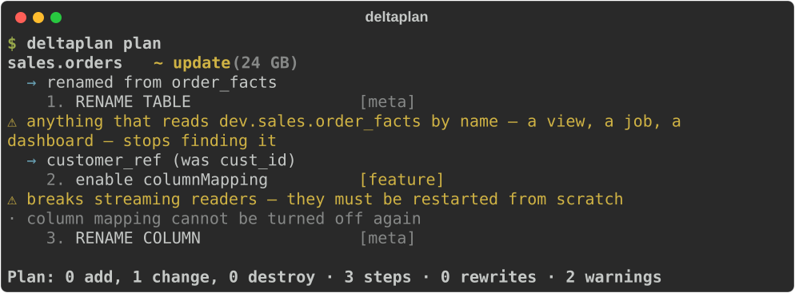

Renaming a column needs Delta's column mapping, which the plan turns on first. Once
the rename has been applied everywhere, `renamed_from` has done its job and the plan
says it can go. [Renames →](spec.md#renames)

## Widening types

A wider type is a metadata change once type widening is on. This works at the top level
and anywhere inside a struct, array or map.

```yaml title="tables/orders.yml"
--8<-- "assets/screens/feature-widening.yml"
```

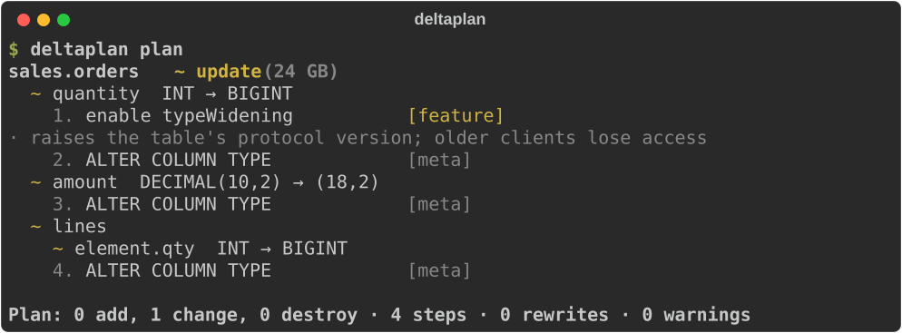

Which widenings Delta allows was checked against a live workspace.
[The list →](spec.md#rewrites-and-using)

## Rewrites

A type change that isn't a widening means the data has to move. deltaplan stages the
converted rows, checks them against the original, replaces the table from them (keeping
its identity and history), puts back what a query result can't carry, and drops the
staging copy. `using:` says how to convert where a plain cast isn't right.

```yaml title="tables/orders.yml"
--8<-- "assets/screens/feature-rewrite.yml"
```

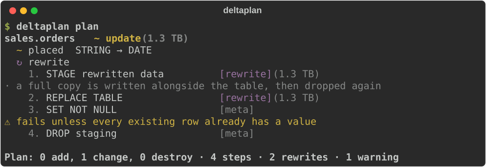

The table's size is on every step that rewrites it, and a restore point is recorded
first. [What a rewrite does →](safety.md#what-a-rewrite-actually-does)

## NOT NULL

A new column arrives empty in every existing row, so `using:` fills them before
`NOT NULL` is set. A field inside a struct can be made `NOT NULL` in place too.

```yaml title="tables/orders.yml"
--8<-- "assets/screens/feature-not-null.yml"
```

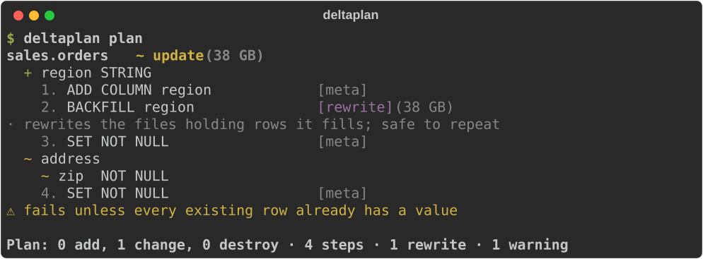

Before each `SET NOT NULL`, deltaplan checks for NULLs, so a column that isn't ready is
refused with a clear reason, not a half-applied plan.
[NOT NULL columns →](spec.md#adding-a-not-null-column-to-a-table-with-data)

## Partitioning to liquid clustering

The migration most older Databricks tables need: take `partitioned_by` out, put
`cluster_by` in. Delta can't cluster a partitioned table in place, so the plan rewrites
it, rows and all, and shows what that costs. Nothing is converted here, so it is a
single statement: [the data is written once](safety.md#a-rewrite-that-converts-nothing-writes-once).

```yaml title="tables/events.yml"
--8<-- "assets/screens/feature-partitioning.yml"
```

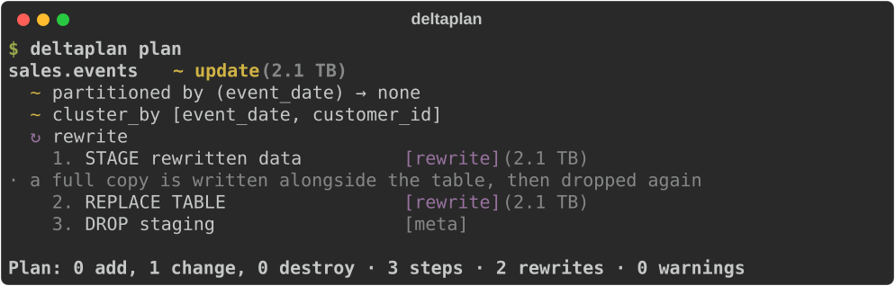

A spec that leaves `partitioned_by` out keeps the table's partitions, so nothing is
rewritten by surprise. [Partitioning →](spec.md#partitioning)

## Seeds

The other half of the setup notebook: the table, and the handful of rows that belong in
it. A CSV beside the spec, or a few rows written out in it — either way the file is the
truth, and applying it replaces what the table holds.

```yaml title="tables/countries.yml"
table: ${catalog}.reference.countries
columns:
  - {name: code, type: string, nullable: false}
  - {name: name, type: string}
seed: countries.csv
```

The plan compares a hash the loaded table carries, so it costs nothing to ask and says
*seed 2 rows from countries.csv* instead of printing them.
[Seeds →](spec.md#seeds)

## Constraints

Primary keys, foreign keys and CHECKs. Keys are informational in Unity Catalog; a CHECK
is enforced, so adding one validates every row, and the plan says so.

```yaml title="tables/orders.yml"
--8<-- "assets/screens/feature-constraints.yml"
```

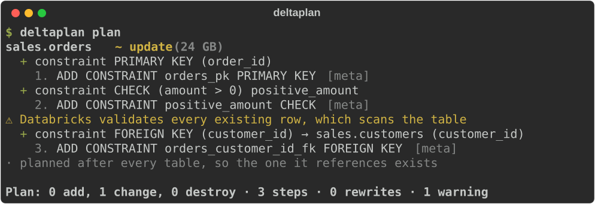

Foreign keys are planned after every table, so the table they reference always exists
first. [Constraints →](spec.md#constraints)

## Clustering

Liquid clustering keys, or `auto` to let Databricks choose them.

```yaml title="tables/orders.yml"
--8<-- "assets/screens/feature-clustering.yml"
```

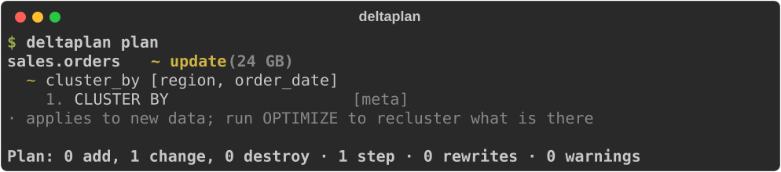

[Clustering →](spec.md#clustering)

## Tags, grants and owners

Table tags, column tags, grants per principal, and the owner. A principal the spec names gets
exactly those privileges. One it doesn't name is someone else's business: it's
reported, never touched. The same goes for a tag the spec doesn't mention, so removing
one takes a `null`. A new owner is always the last step: after it, deltaplan may not be
allowed to change the table.

```yaml title="tables/customers.yml"
--8<-- "assets/screens/feature-tags-and-grants.yml"
```

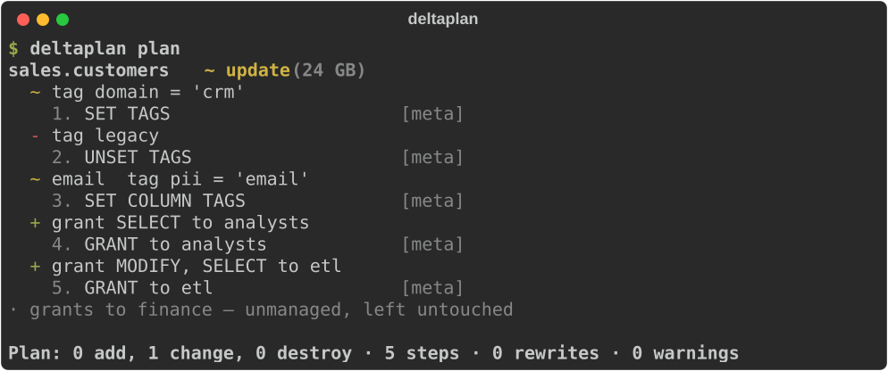

[Column tags →](spec.md#column-tags) · [Removing a tag →](spec.md#removing-a-tag-or-a-property) ·
[Grants →](spec.md#grants) · [Owners →](spec.md#owners)

## Handing something to another tool

Plenty of teams already have something that owns part of a table: a policy framework
that sets grants, a catalogue that writes the tags an ABAC rule reads, a data contract
that owns every description. Two tools writing
the same thing is how a Monday starts with a table nobody recognises — so `manage:` draws
the line, and deltaplan stays on its side of it.

```yaml title="deltaplan.yml"
--8<-- "assets/screens/feature-manage.yml"
```

A key that isn't deltaplan's is refused where you write it, not ignored later:

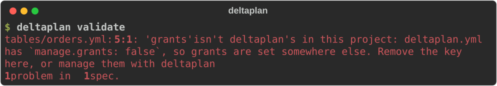

And the plan says what it could not have touched, so a reviewer doesn't have to guess:

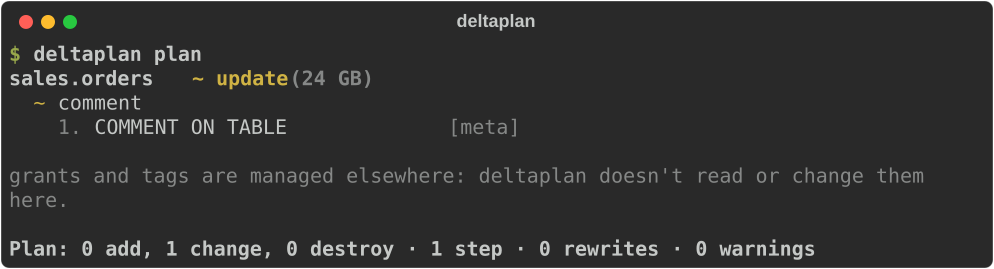

[What can be handed over →](spec.md#what-deltaplan-manages)

## Masks and row filters

A column mask or row filter points at a SQL function, which can be a
[function spec](#functions) in the same project. deltaplan treats them as security
controls. It adds and replaces them and never removes one. A new table is created with
them, so it never exists unprotected, even for a moment.

```yaml title="tables/customers.yml"
--8<-- "assets/screens/feature-masks.yml"
```

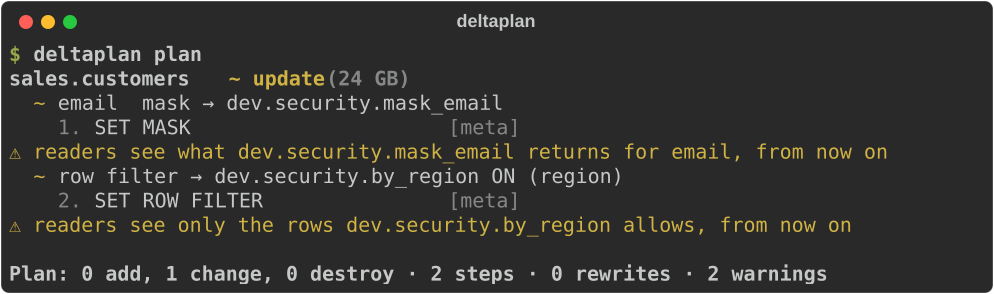

[Masks and row filters →](spec.md#column-masks-and-row-filters)

## Views

A view's shape is its query. A changed query replaces the view, and its tags and
grants, which a replace drops, are put back straight after.

```yaml title="tables/big_orders.yml"
--8<-- "assets/screens/feature-views.yml"
```

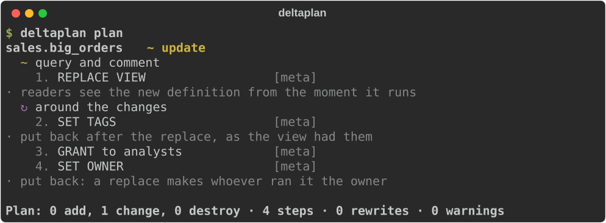

[Views →](spec.md#views)

## Functions

SQL functions: parameters, return type and body. A changed body replaces the function,
and puts its grants back. The plan warns that everything calling it sees the new
definition at once.

```yaml title="tables/order_band.yml"
--8<-- "assets/screens/feature-functions.yml"
```

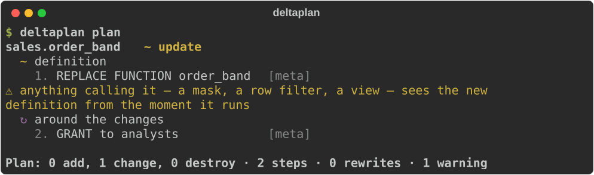

[Functions →](spec.md#functions)

## Schemas and volumes

A schema's comment, tags and grants, and managed volumes: places for files. Neither is
ever dropped.

=== "tables/_schema.yml"

    ```yaml
    --8<-- "assets/screens/feature-schema.yml"
    ```

=== "tables/landing.yml"

    ```yaml
    --8<-- "assets/screens/feature-volumes.yml"
    ```

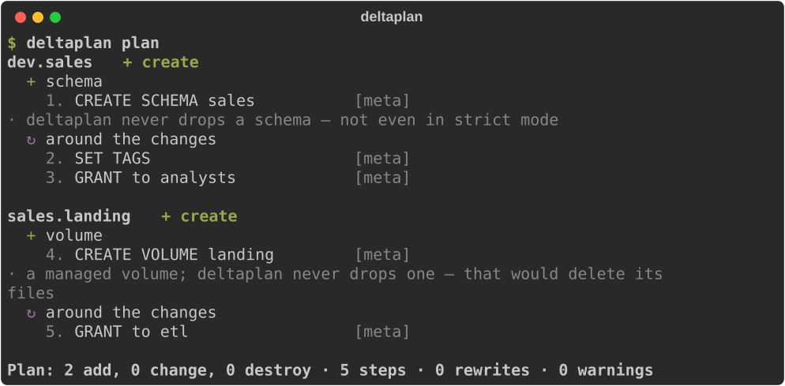

[Schemas →](spec.md#schemas) · [Volumes →](spec.md#volumes)

## Identity, generated and default columns

A default can be set at any time; it needs a table feature the first time. An identity
or generated column only exists from table creation, so adding one to an existing
table is refused, with the reason, rather than planned as something that would fail.

```yaml title="tables/orders.yml"
--8<-- "assets/screens/feature-generated.yml"
```

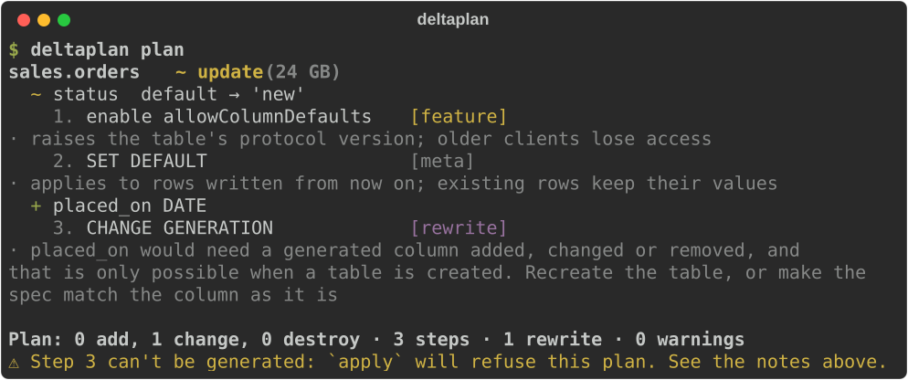

[Identity, generated and default columns →](spec.md#identity-generated-and-default-columns)

## Hooks

SQL to run before and after a table's changes, for what a spec can't say. Hooks run
only when the table changes.

```yaml title="tables/orders.yml"
--8<-- "assets/screens/feature-hooks.yml"
```

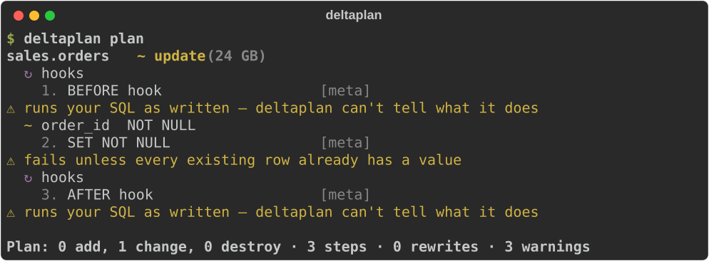

[Hooks →](spec.md#hooks)

## Ownership

deltaplan only ever drops what it manages. A table it created carries a marker. A table
someone else made is *claimed* the first time a spec describes it, as a visible step of
its own. Anything no spec describes is listed as unmanaged and left alone.

```yaml title="tables/orders.yml"
--8<-- "assets/screens/feature-ownership.yml"
```

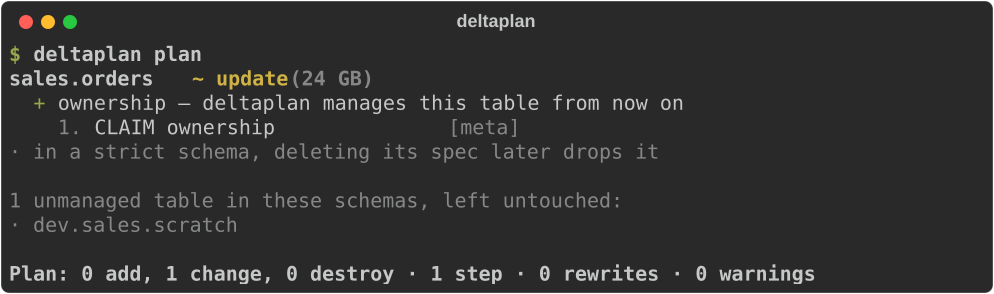

[Safety model →](safety.md)

## Strict schemas

In an additive schema (the default) a managed table whose spec is deleted stays. In a
strict schema it's dropped, as a `destructive` step `apply` won't run without
`--allow-destructive`.

```yaml title="deltaplan.yml" hl_lines="10-11"
--8<-- "assets/screens/feature-strict.yml"
```

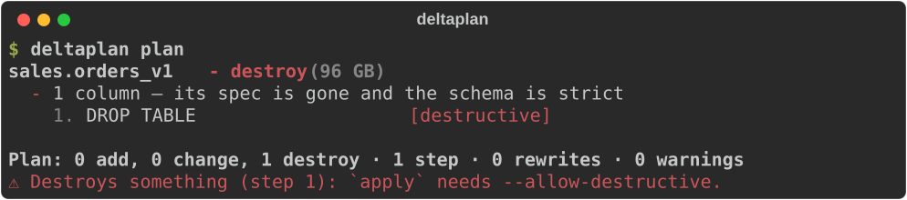

[Additive and strict schemas →](safety.md#additive-and-strict-schemas)

## Import

Most schemas exist before deltaplan does. `import` writes a spec for everything in one,
tables, views, functions and volumes, so the first plan has nothing to do but claim
them.

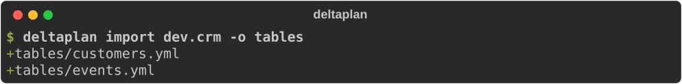

```yaml title="tables/customers.yml"
--8<-- "assets/screens/feature-import.yml"
```

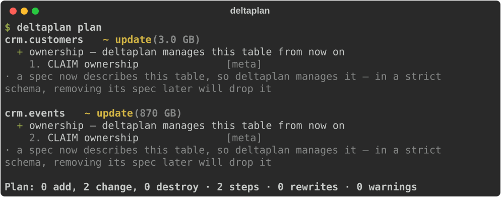

`import -f sql` writes `CREATE` statements instead. [Commands →](cli.md#import)

## SQL specs, and what they can't say

A SQL spec supports exactly what sqlglot can parse. What it can't parse, such as a column
mask, is an error that points you to YAML, never a silent gap.

```sql title="tables/customers.sql"
--8<-- "assets/screens/feature-sql-limits.sql"
```

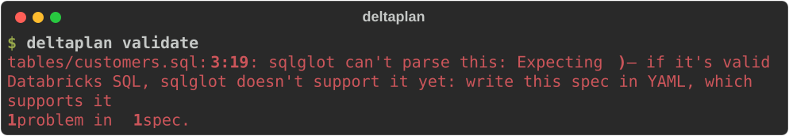

[YAML and SQL specs →](formats.md)
