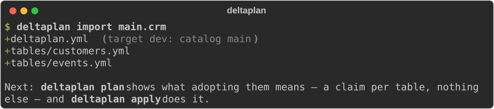
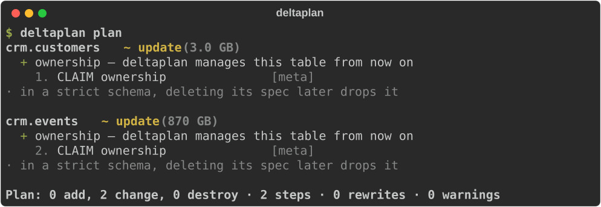
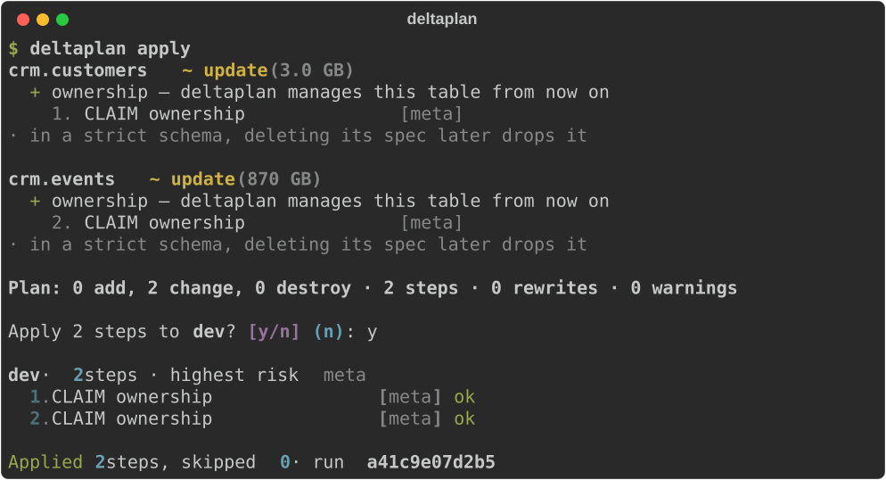
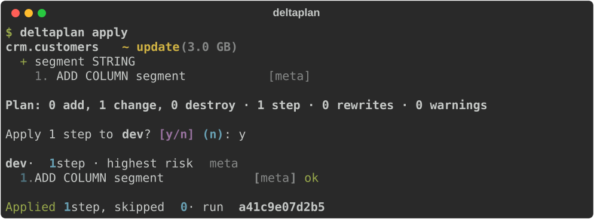

# Get started

From an existing schema to tables you change by editing a file, in about ten minutes.
You need a Databricks workspace with Unity Catalog, a SQL warehouse, and a schema you may
change: a dev catalog is the place to start.

!!! tip "Already have an Asset Bundle?"
    Start at [With an Asset Bundle](bundles.md) instead: deltaplan reads your
    `databricks.yml` — its targets, workspaces, variables and the schemas it declares —
    so you write none of it twice.

## 1. Install

```sh
uv tool install --prerelease allow deltaplan
deltaplan --version
```

No uv? `pipx install --pip-args=--pre deltaplan` works too; [Installation](installation.md)
has every option. The `--prerelease` flag is there because every release so far is an
alpha.

## 2. Connect

deltaplan uses the Databricks SDK's authentication, so whatever works for the Databricks
CLI works here. The quickest way is three environment variables:

```sh
export DATABRICKS_HOST="https://dbc-1234abcd-5678.cloud.databricks.com"
export DATABRICKS_TOKEN="dapi…"            # User settings → Developer → Access tokens
export DATABRICKS_WAREHOUSE_ID="1a2b3c4d5e6f7a8b"
```

The warehouse id is the last part of the warehouse's HTTP path: open **SQL Warehouses**,
pick one, and look under **Connection details** for `/sql/1.0/warehouses/1a2b3c4d5e6f7a8b`.
A 2X-Small serverless warehouse is plenty.

!!! tip "Rather use the Databricks CLI's login?"
    `databricks auth login --host https://… --profile dev`, then add
    `--profile dev` to the `import` below — it writes the profile into the project, so
    you never type it again.

!!! tip "Something not working?"
    `deltaplan doctor` checks the connection, the warehouse, the metastore's quota and
    the rest, and says what to do about whatever isn't right. It changes nothing.

## 3. Import a schema

Start in an empty directory and import a schema whose tables you'd otherwise manage by
hand — here `main.crm`:

```sh
mkdir crm-tables && cd crm-tables
deltaplan import main.crm
```



That wrote one spec per table, view and function, and a `deltaplan.yml` with one target,
`dev`, whose catalog is the one you imported from:

=== "deltaplan.yml"

    ```yaml
    --8<-- "assets/screens/start-project.yml"
    ```

=== "tables/customers.yml"

    ```yaml
    --8<-- "assets/screens/start-customers.yml"
    ```

Specs say `${catalog}` rather than `main`, so the same files serve another catalog later:
add a target with its own `catalog`, and pick it with `-t`.

## 4. Plan, then apply

`plan` compares the specs with what's live. Straight after an import they match, so the
only thing to do is **claim** the tables — mark them as deltaplan's, which is what lets it
manage them from now on:



`apply` plans the same thing, shows it, and asks before it changes anything:



`apply` keeps a record of every run in `main.deltaplan` — the `history_schema` in
`deltaplan.yml` — and creates that schema the first time, so you need permission to create a
schema in the catalog.

## 5. Change a table by editing its spec

Here's the point of it. Add a column to `tables/customers.yml`:

```yaml
- name: segment
  type: string
  comment: B2B or B2C
```

and apply again:



No notebook, no `ALTER TABLE` to write, and the next person reads the table's shape from
one file. A new table is a new spec file; a rename is `renamed_from`; a type that can't
change in place is rebuilt with its data — the plan always says which, and what it costs,
before anything runs.

## Where next

- **[A tour](tour.md)** — every command, from an empty catalog to a reviewed pull request.
- **[Feature gallery](features.md)** — each kind of change, with its spec and its plan.
- **[In CI](ci.md)** — plan every pull request, apply on merge.
- **[Writing a spec](spec.md)** — the full reference.
- **[Safety model](safety.md)** — what deltaplan will and won't do to your tables.
