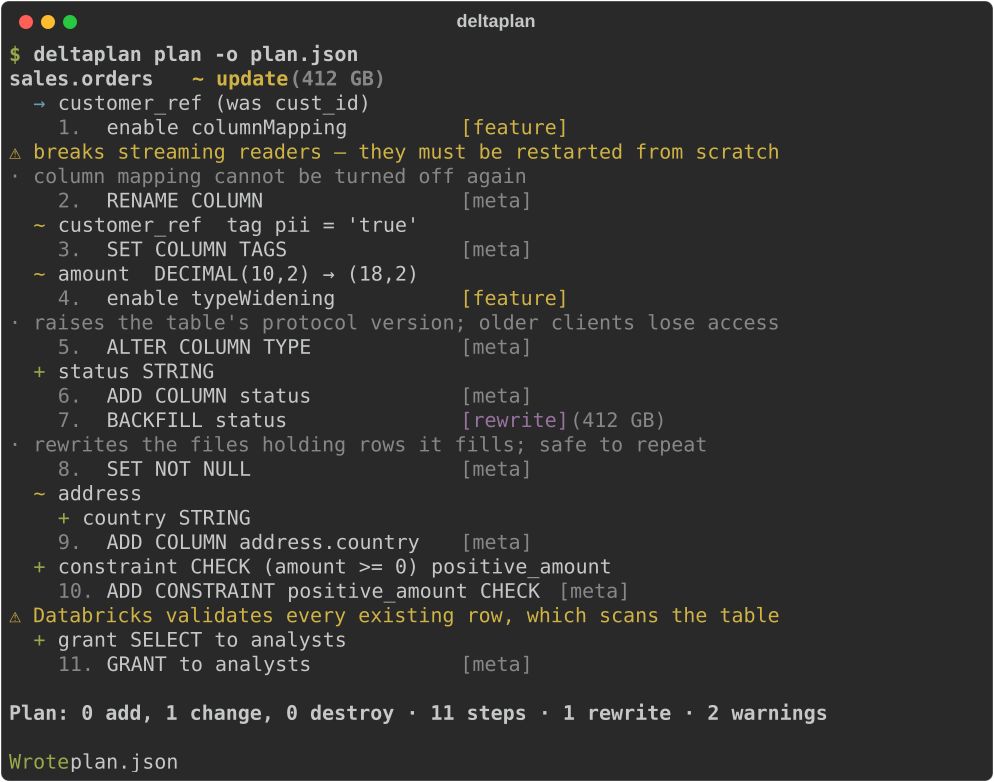

# deltaplan

Declarative, Terraform-style `plan` / `apply` for Databricks SQL tables — Unity Catalog and Delta.

!!! warning "Alpha"
    Every milestone in the design is built, and the assumptions deltaplan makes about
    Databricks are checked by a live test suite against a real workspace — see
    [testing](testing.md). It is still an alpha: try it on dev before production, and
    expect the spec format to change before the first stable release.

Describe the tables you want in YAML or SQL, diff that against live Unity Catalog, review
a plan, then apply it. deltaplan knows which Delta changes are metadata-only, which need
a table feature enabled first, and which force a rewrite — and it says so before it
touches anything.

[Take the tour](tour.md){ .md-button .md-button--primary }
[See every feature](features.md){ .md-button }

## Highlights

- **A plan you can actually read** — per table, per column, nested struct changes as a
  tree, numbered steps, risk labels, and size hints on anything that rewrites.
- **Delta-aware planning** — metadata-only vs. table-feature vs. rewrite is a
  classification the planner makes explicit, not a surprise at apply time.
- **Safe by default** — only tables deltaplan manages can ever be drop candidates.
  Everything else is reported as unmanaged and left alone; destructive steps need
  `--allow-destructive`.
- **No state file** — Unity Catalog *is* the state. Nothing to sync, nothing to corrupt.
- **Nested types are first class** — struct, array and map fields diff by path
  (`address.element.zip`), with per-field comments and renames.
- **Built for CI** — a `drift` command with a non-zero exit code, a Markdown renderer
  for PR comments, and JSON for anything else.
- **Fits your stack** — Python-native, Apache-2.0, and happy next to Databricks Asset
  Bundles.

## Next steps

- [A tour](tour.md) — one project from nothing to a reviewed pull request, in ten minutes.
- [Feature gallery](features.md) — every kind of change, with its spec and its plan.
- [Installation](installation.md) — install with uvx, uv tool, or pipx.
- [Writing a spec](spec.md) — the YAML format, types, and renames.
- [Commands](cli.md) — `validate`, `import`, `plan`, `apply`, `drift`.
- [Safety model](safety.md) — ownership, risk classes, and what deltaplan refuses to do.
