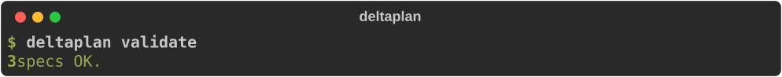
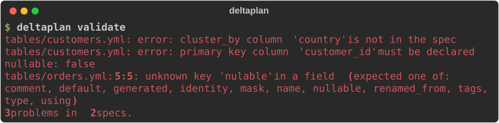
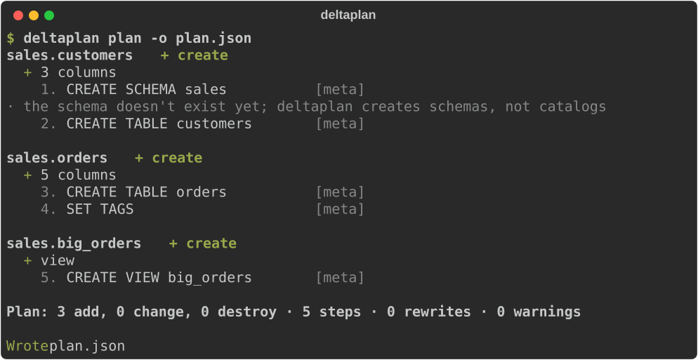
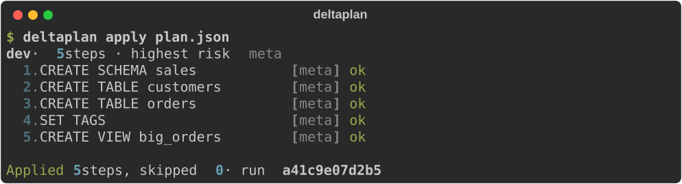
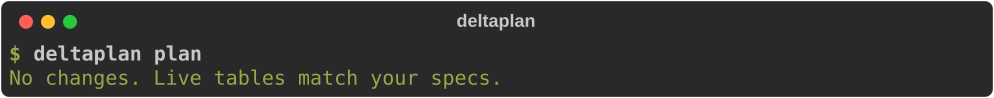
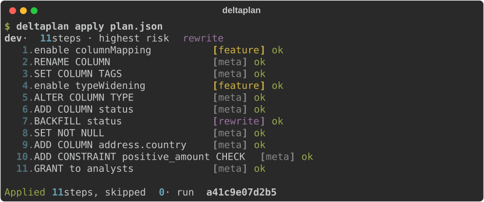
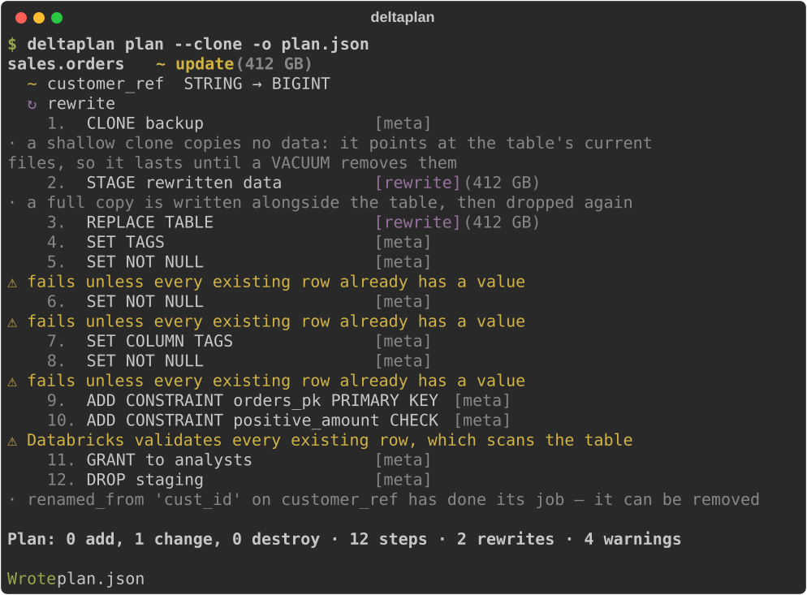
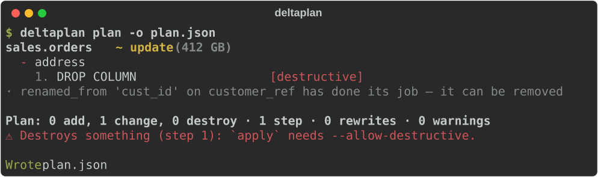
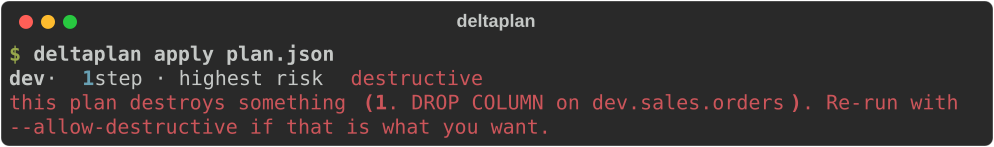
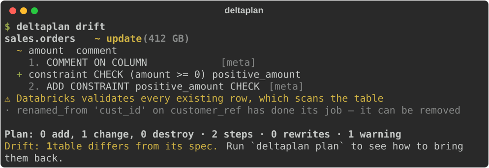

# A tour of deltaplan

Ten minutes, one project, every command: from nothing, to tables, to a change reviewed
in a pull request. Every terminal on this page is deltaplan's real output. A script runs
the actual CLI against an in-memory catalog (`tests/screens.py`), and a test fails when a
picture no longer matches what the CLI prints.

<hr class="dp-rule">

## 1. A project

A project is a `deltaplan.yml` and a directory of specs. The project file says where the
specs are and what each target substitutes into them. Here there's one target, `dev`, so
every command below uses it without `-t dev`.

```yaml title="deltaplan.yml"
--8<-- "assets/screens/tour-project.yml"
```

A spec describes a table as you want it to be. Write it in YAML, or as the `CREATE TABLE`
you'd write anyway: both describe the same model. See
[YAML and SQL specs](formats.md) for what each can say.

=== "tables/orders.yml"

    ```yaml
    --8<-- "assets/screens/tour-orders.yml"
    ```

=== "tables/customers.sql"

    ```sql
    --8<-- "assets/screens/tour-customers.sql"
    ```

The project also has a view, `big_orders`, over `orders`.

## 2. Check it

`validate` reads every spec and checks it: no workspace, no network, so it's safe in a
pre-commit hook.



A spec with mistakes in it says where, down to the line and column, so a typo in a key is
caught here rather than silently ignored:



## 3. Plan

`plan` reads what's live, diffs it against your specs, and prints what it would do. On an
empty catalog that's everything. The schema is created first, then each table and the
view, and every step is numbered and labelled with its **risk class**.



| Risk | Means |
|---|---|
| `meta` | a metadata change — instant, no data touched |
| `feature` | turns on a Delta table feature a later step needs, as a step of its own, with what it costs |
| `rewrite` | rewrites data files — slow and costly on a big table; a restore point is recorded first |
| `destructive` | drops something; `apply` refuses it without `--allow-destructive` |

`-o plan.json` saves the plan. That file is what you review and what `apply` runs, so
what runs is exactly what was reviewed.

## 4. Apply



Every run is recorded in Delta tables in your `history_schema`. The run id names it. An
interrupted apply picks up where it stopped when you run it again.

Plan again and there's nothing left to do. Unity Catalog *is* the state: there's no state
file to keep in sync.



## 5. Change something

A few weeks later, `orders` needs to change. The customer column gets its proper name and
a tag, `amount` needs more digits, every order gets a `status`, addresses get a country,
amounts can't go negative, and analysts may read the table:

```yaml title="tables/orders.yml" hl_lines="6-8 16 18-19 21-25 31 34"
--8<-- "assets/screens/tour-orders-changed.yml"
```


Read it top to bottom. It's everything `apply` will do, in order:

- **A rename, not a drop and an add.** `renamed_from` says what happened, so the data
  stays. Renaming needs Delta's column mapping, so the plan turns that on first, as a
  `feature` step, and warns what it breaks.
- **Widening is metadata.** `DECIMAL(10,2) → (18,2)` needs type widening, turned on once,
  then it's instant. What Delta can't widen in place is planned as a rewrite (step 6).
- **A new NOT NULL column gets filled first.** `using: "'open'"` fills the existing rows,
  then `NOT NULL` is set. The fill rewrites files, so it's a `rewrite` step, with the
  table's size next to it.
- **Nested fields are first class.** `address.country` is added inside the struct.
- **Warnings say what a step costs.** A new CHECK scans every row, and the plan says so.



## 6. When the data has to move

Some changes can't be made in place. Here `customer_ref` becomes a `bigint`. Delta can't
cast a column's data in place, so deltaplan rebuilds the table: it stages the converted
rows, replaces the table from them (keeping its identity and history), puts back what a
query result can't carry, and drops the staging table. `--clone` takes a zero-copy backup
first.



deltaplan writes the obvious conversions itself (a cast, a struct rebuilt field by field)
and asks for a [`using:` expression](spec.md#rewrites-and-using) where it shouldn't
guess. The [safety model](safety.md#what-a-rewrite-actually-does) has the details.

## 7. When something would be destroyed

Take `address` out of the spec and the plan says, in red, that it drops a column:



`apply` refuses a plan like that before running anything, until you say you mean it:



Only what deltaplan manages can ever be dropped. A table someone made by hand is
reported as unmanaged and left alone. See [ownership](features.md#ownership).

## 8. When someone changes things by hand

Someone edits a comment in Catalog Explorer and drops a constraint. `drift` compares live
tables with the specs and exits with **2** when they differ, so a scheduled job can
alert on it:



## 9. In a pull request

In CI, the [GitHub Action](ci.md) plans every pull request and posts the plan as a
comment, updated on every push. This is the comment for the change in step 5, as
`deltaplan plan -f md` writes it:

<div class="dp-comment" markdown>

--8<-- "assets/screens/tour-comment.txt"

</div>

On merge, a workflow runs `deltaplan apply` on the plan that was reviewed. [In CI](ci.md)
has both workflows, ready to copy.

## Where next

- **[Feature gallery](features.md)**: every kind of change, each with its spec and plan.
- **[Writing a spec](spec.md)**: the full reference.
- **[Commands](cli.md)**: every command and flag.
- **[Safety model](safety.md)**: what deltaplan will and won't do to your tables.
- **[In CI](ci.md)**: the GitHub Action.
